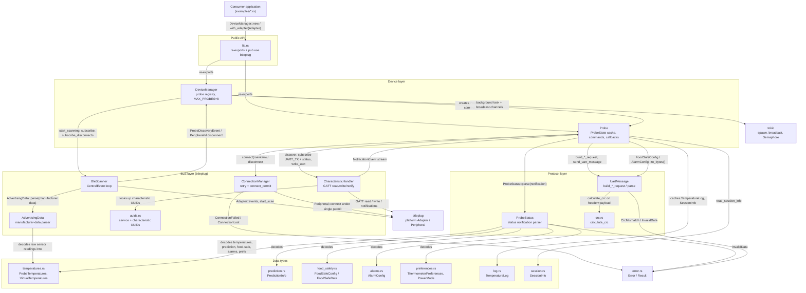

# Architecture

<!-- AUTO:GENERATED — managed by /engineering-plugin:architecture.
     Sections between AUTO:* markers are regenerated on every refresh.
     Prose outside markers (notably ## Decisions) is preserved verbatim. -->

<!-- AUTO:SUMMARY -->
`combustion-rust-ble` is a single Rust library crate that lets applications discover, connect to, and control Combustion Inc Predictive Thermometer probes over Bluetooth Low Energy on macOS, Linux, and Windows. It is organised as four layers: a public API surface (`lib.rs`) that re-exports the device layer (`DeviceManager`, `Probe`) and the data types; a device layer that owns the probe registry, per-probe cached state, and tokio broadcast channels for discovery, staleness, disconnects, temperatures, predictions, and log-sync progress; a BLE layer built on `btleplug` that scans for Combustion manufacturer data, serialises `Connect()` calls through a shared single-permit semaphore, and handles GATT reads/writes/notifications; and a protocol layer that parses Probe Status notifications and builds CRC-checked UART request messages. The `data` module holds the plain domain types (temperatures, prediction, food safety, alarms, preferences, session, log) that the protocol layer decodes and the device layer caches and broadcasts. Only Predictive Probes (ProductType 1) are admitted to the registry, and at most `MAX_PROBES` (8) are managed concurrently.
<!-- /AUTO:SUMMARY -->

<!-- AUTO:DIAGRAM -->

<!-- /AUTO:DIAGRAM -->

<!-- AUTO:COMPONENTS -->
## Components

| Component | Purpose | Key files |
|---|---|---|
| Public API | Crate root: module declarations, convenience re-exports of `DeviceManager`, `Probe`, `Error`, data types, and `pub use btleplug` so callers can hand in a matching `Adapter`. | `src/lib.rs` |
| DeviceManager | Central entry point. Owns the `BleScanner`, the serial-number-keyed probe registry (capped at `MAX_PROBES`), the adapter-level single-permit `connect_permit` semaphore shared with every probe, and broadcast channels for probe-discovered, probe-stale, and link-layer-disconnect events. Runs a background tokio task that filters discovery events to Predictive Probes only and routes `DeviceDisconnected` to the affected `Probe`. Constructed via `new()` (first adapter) or `with_adapter(Adapter)`. | `src/device_manager.rs` |
| Probe | Per-probe handle. Holds a `ProbeState` cache (temperatures, prediction, battery, mode, overheating, sequence numbers, food-safe data, alarms, preferences, RSSI, last-update), a `ConnectionManager`, and an optional `CharacteristicHandler`. `connect()` performs link connect then GATT setup (discover, subscribe UART TX + Probe Status, start notifications) and spawns a status-notification task that parses `ProbeStatus` and updates state. Exposes async commands (prediction, food safety, alarms, power mode, ID/colour, session info, firmware/hardware revision) and broadcast/callback subscriptions for temperatures, predictions, and log-sync progress. | `src/probe.rs` |
| BleScanner | Wraps a `btleplug` `Adapter`. Starts/stops scanning, consumes the `CentralEvent` stream, parses Combustion manufacturer data via `AdvertisingData::parse`, tracks RSSI, and broadcasts `ProbeDiscoveryEvent` and `PeripheralId` disconnect events to the `DeviceManager`. | `src/ble/scanner.rs` |
| ConnectionManager | Manages one peripheral's link state (`ConnectionState`), connect with bounded retries and a services-resolved timeout, clean disconnect, and maintain-connection flag. Acquires the shared `connect_permit` only for the `Peripheral::connect` round-trip so concurrent multi-probe connects are serialised (BlueZ safety) without blocking service resolution. | `src/ble/connection.rs` |
| CharacteristicHandler | GATT access for a connected peripheral: characteristic discovery, read/write (with or without response), subscribe/unsubscribe, a notification listener task that fans out `NotificationEvent`s over a broadcast channel, UART TX/RX helpers, and Device Information reads (manufacturer, model, serial, firmware, hardware). | `src/ble/characteristics.rs` |
| Advertising parser | Decodes Combustion manufacturer-specific advertising payloads into `AdvertisingData` (product type, serial number, probe ID/colour, mode, battery, overheating flags, raw and virtual temperatures). Also defines `ProductType`, `ProbeMode`, `BatteryStatus`, `ProbeId`, `ProbeColor`, `Overheating`. | `src/ble/advertising.rs` |
| UUID constants | Combustion service/characteristic UUIDs (Probe Status, UART TX/RX, Device Information) and the manufacturer ID used to filter advertisements. | `src/ble/uuids.rs` |
| Probe Status parser | Parses the Probe Status characteristic notification into `ProbeStatus`: min/max log sequence numbers, temperatures, virtual sensors, prediction info, food-safe config/status, thermometer preferences, and alarm configuration. | `src/protocol/status.rs` |
| UART messages | `UartMessageType`, `UartMessageHeader`, `UartMessage` with sync bytes, CRC-16 framing, `parse()`/`to_bytes()`, and `build_*_request` constructors for every supported command (session info, logs, probe ID/colour, prediction, food safe, power mode, reset, alarms, silence). | `src/protocol/uart_messages.rs` |
| CRC | CRC-16 implementation (`calculate_crc`, `verify_crc`, `append_crc`) used to frame and validate UART messages. | `src/protocol/crc.rs` |
| Data types | Plain domain structs/enums shared across layers: raw and virtual temperatures with C/F conversion, prediction state/mode/type, SafeCook/USDA food-safety config and status (simplified and integrated products, servings), alarm configuration, thermometer preferences and power mode, session info, and the temperature log with `LoggedDataPoint`/`PredictionLog`. | `src/data/mod.rs`, `src/data/temperatures.rs`, `src/data/prediction.rs`, `src/data/food_safety.rs`, `src/data/alarms.rs`, `src/data/preferences.rs`, `src/data/session.rs`, `src/data/log.rs` |
| Error handling | `thiserror`-derived `Error` enum (`Bluetooth` from `btleplug::Error`, `BluetoothUnavailable`, `ProbeNotFound`, `NotConnected`, `ConnectionFailed`, `ConnectionLost`, `DeviceDisconnectedDuringSetup`, `InvalidData`, `CrcMismatch`, ...) and the crate-wide `Result<T>` alias. | `src/error.rs` |
| Utilities | Temperature unit conversion helpers (`celsius_to_fahrenheit`, `fahrenheit_to_celsius`). | `src/utils.rs` |
| Examples | Runnable consumers covering discovery, temperature monitoring, log download, prediction, multi-probe, food safety, alarms, existing-adapter injection, a Ratatui dashboard, and a debug tool. | `examples/discover_probes.rs`, `examples/temperature_monitor.rs`, `examples/log_download.rs`, `examples/prediction_cooking.rs`, `examples/multi_probe.rs`, `examples/food_safety.rs`, `examples/alarm_control.rs`, `examples/existing_adapter.rs`, `examples/probe_dashboard.rs`, `examples/probe_debug.rs` |
| Release automation | `release.sh` verifies the pushed `v<semver>` tag matches `Cargo.toml` and publishes to crates.io idempotently; the workflow runs it on tag push. Versions and tags themselves come from the engineering-plugin `/release` skill. | `release.sh`, `.github/workflows/release.yml` |
<!-- /AUTO:COMPONENTS -->

## Decisions

## Generated

<!-- AUTO:META -->
Last refreshed: 2026-09-05 21:00
Triggered by: issue-close #2 #3 #4
Diagram type: flowchart
Source-of-truth: REQUIREMENTS.md ## Architecture + code structure scan
<!-- /AUTO:META -->
